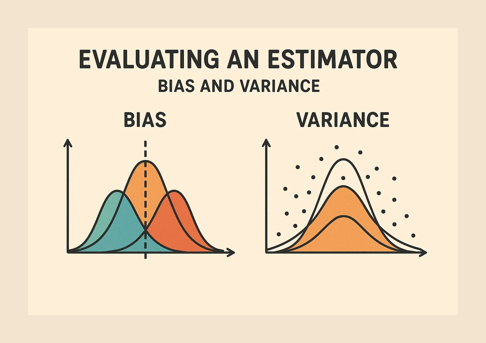

# Evaluating an Estimator (Bias and Variance)

An estimator is an equation for picking the “best,” or most likely accurate, data model based upon observations in reality.

There are various ways to evaluate a machine-learning model. We can use MSE (Mean Squared Error) for Regression; Precision, Recall, and ROC (Receiver of Characteristics) for a Classification Problem along with Absolute Error. In a similar way, Bias and Variance help us in parameter tuning and deciding better-fitted models among several built.

## Bias
Let’s say at the start of the semester you thought that this semester I am going to get 9.9 CGPA but what happened when you see the result, you saw you have 5 backlogs 1 in lab and 4 in theory. This is bias.

So what exactly is bias now, your inability to predict your CGPA

Bias is simply defined as the inability of the model because of that there is some difference or error occurring between the model’s predicted value and the actual value.

Let Y be the true value of a parameter, and let Y^ be an estimator of Y based on a sample of data. Then, the bias of the estimator Y^ is given by:

Bias(Y^)=E(Y^)−Y

where E(Y^) is the expected value of the estimator Y^. It is the measurement of the model that how well it fits the data.

### Low Bias:(being practical)

At the start of semester, you thought that you might pass the semester and in reality you actually scored 7 CGPA. This means you are practical about your semester exams.

Low bias value means fewer assumptions are taken to build the target function. In this case, the model will closely match the training dataset.

### High Bias:

(Excess of something) Excessive optimism and pessimism

High bias value means more assumptions are taken to build the target function. In this case, the model will not match the training dataset closely.

## Variance
Suppose you are giving your internal exam of ML and a PHD scholar from ML LAB (a nice guy who always helps students ) comes to conduct the paper, what will happen? everyone from class will get at least 15 marks (out of 25), because you are able to use your phone, cheat , or look at someone else’s paper.

But, let’s assume the strictest professor (say) Banarjee Sir came as your examiner in the internal paper what will happen! you will probably end up with single digit marks in the paper, it might be zero also :)

“Your score depends upon who is the examiner”

same here the performance of the model depends upon the dataset we have used.

Variance is the amount by which the performance of a predictive model changes when it is trained on different subsets of the training data.

Variance is the variability of the model that how much it is sensitive to another subset of the training dataset. i.e. how much it can adjust on the new subset of the training dataset.

Let Y be the actual values of the target variable, and Y^ be the predicted values of the target variable. Then the variance of a model can be measured as the expected value of the square of the difference between predicted values and the expected value of the predicted values.

Variance = E[(Y^ — E[Y^])²]

where E[Y^] is the expected value of the predicted values. Here expected value is averaged over all the training data.

### Low variance:

You are fully prepared for the upcoming internal exam. Let’s suppose your are Chatur (aka Silencer ) from 3 idiots, whoever is going to conduct the paper you are going to score above 20(out of 25),

here whatever dataset you will use, the result will show less variance or less sensitivity to the dataset

Low variance means that the model is less sensitive to changes in the training data and can produce consistent estimates of the target function with different subsets of data from the same distribution.

### High variance:

If you are not prepared for the test, then you are simply dependent on the environment( i.e. who is the examiner)

meaning what type of dataset will be taken into consideration i.e. it is very sensitive

High variance means that the model is very sensitive to changes in the training data and can result in significant changes in the estimate of the target function when trained on different subsets of data from the same distribution.

## Bias-Variance Tradeoff
### High Bias, Low Variance: 
A model with high bias and low variance is said to be under fitting (Underfitting problem arises when both the “training errors and test errors are large”).

### High Variance, Low Bias: 
A model with high variance and low bias is said to be over fitting (Overfitting problem arises when training errors are small but test errors are large).

### High-Bias, High-Variance: 
A model has both high bias and high variance, which means that the model is not able to capture the underlying patterns in the data (high bias) and is also too sensitive to changes in the training data (high variance). As a result, the model will produce inconsistent and inaccurate predictions on average.

Like in the start of the college you thought that you will get 9.9 CGPA at the end of your Under graduation with a 1.5 Crore package but in reality you end up with 4 CGPA, 10 theory backlogs and 4 lab backlogs with a loan of 8.54 Lakh along, with an unemployment.

### Low Bias, Low Variance: 
A model that has low bias and low variance means that the model is able to capture the underlying patterns in the data (low bias) and is not too sensitive to changes in the training data (low variance). This is the ideal scenario for a machine learning model, as it is able to generalize well to new, unseen data and produce consistent and accurate predictions. But in practice, it’s not possible.

Like in the start of the college you thought that I will get 9.9 CGPA at the end of my Under graduation with a 1.5 Crore package but I have written something in the last i.e. in practice it’s not possible.

The Bias-Variance Dilemma is a fundamental concept in machine learning that highlights the trade-off between bias and variance when tuning the complexity of a model. Understanding this trade-off is crucial for building models that generalize well to new, unseen data. The Bias-Variance Dilemma suggests that there is a trade-off between bias and variance. Increasing model complexity tends to decrease bias but increase variance, and vice versa. The goal is to find the right level of model complexity that minimizes both bias and variance, striking a balance that leads to optimal performance on new, unseen data.

In summary, model selection involves navigating the Bias-Variance Dilemma by choosing models with an appropriate level of complexity. Techniques such as cross-validation, hyperparameter tuning, regularization, and ensemble methods are essential for achieving this balance and building models that generalize well to new, unseen data.

Thank you for reading till last, I hope that you might have understood the topic clearly :)

