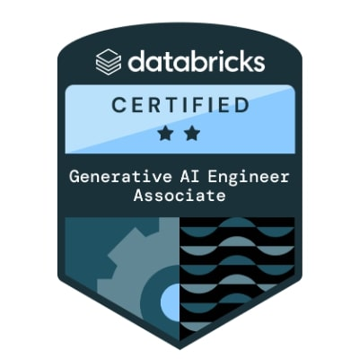

# How I prepared for my Databricks Certified Generative AI Engineer Associate?

Disclaimer: Participation in certification exams is subject to financial risks, learn the course-related modules carefully.

Jokes apart, but after paying $200 for a certification it no longer just remains an exam, it now has a financial angle as well. So while even preparing, our backs are straight because the re-exam will cost you another $200 :)

So let's start with the best thing about the Databricks Certified Generative AI Engineer Associate certification: you don’t need to buy any courses from Udemy or any other platform because Databricks has a free self-paced course available in Databricks Academy. Now one of your financial burdens is relieved by the Databricks team itself.  

This self-paced course has four modules:  

- Generative AI Solution Development (RAG)  
- Generative AI Application Development (Agents)  
- Generative AI Application Evaluation and Governance  
- Generative AI Application Deployment and Monitoring  

---

## Steps to access this free self-paced course  

1. Go to [Databricks Training Login](https://www.databricks.com/learn/training/login)  
2. In **Customer and Prospects**, register yourself  
3. After registration, go to [Databricks Customer Academy](https://customer-academy.databricks.com/pages/29/customer-academy-home-page)  
4. Search for the first module i.e. *Generative AI Solution Development (RAG)* and go to the E-learning one  
5. Enroll yourself and you are ready to learn  
6. Repeat steps 4 and 5 for the rest of the modules  

---

Each module is of **2 hours**, which contains thorough content along with a demo at the end of each chapter of the respective modules. The average completion time is **8 hours** for the course.  

Once done with the course, you can start practicing on the sample test papers to check your understanding of the content. I recommend taking the tests on [SkillCertPro](http://skillcertpro.com) or any other test platforms of your choice. If you have less time left for the exam, it’s highly recommended to give at least **5 tests** and review each of the incorrect answers to understand which topics you are lagging in.  

In my case, I started preparing late, thus I didn’t make any handwritten notes but instead made a digital note which contained the screenshots and important points from the lectures. Due to lack of time, I only gave **3 tests** but reviewed each one thoroughly to understand the weak points and went through my notes again to revise the weak sections.  

Once you are done with the course and have given at least 5 tests with proper reviews, you are good to go. I am saying this is the bare minimum preparation which I did to pass. If you have time, go through all the test papers to gain more experience on the practice papers.  

Thank you for reading till here, have a good day :)
