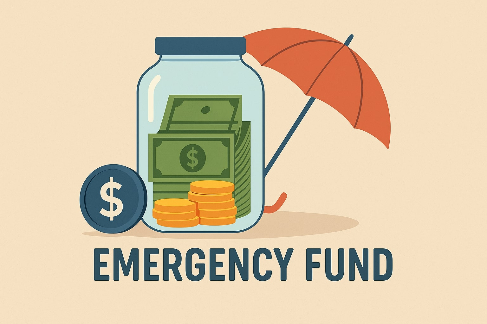

# Emergency Fund - a financial protection to avoid surprises

Those who all know about tech industry might also know the bad times it is going through, from layoffs to salary stagnation, the tech industry is suffering. Many big tech giants like the FAANG or even smaller startups are resorting to rounds and rounds of layoffs. As a result, the uncertainty in the industry is at its peak.
Whenever I see someone in such a situation, I immediately realize the importance of having an emergency fund. I as a software developer in a private job, can be unemployed at any moment and the only thing I can control is to buy some extra time for preparing for a new job and keep myself calm and composed to accept the situation by at least taking care of financial needs. So the most important investment for you is not gold, not stocks, not SIP but Emergency Fund because it's the most handy.

Emergency fund is a stack of money which you keep aside for unexpected situations like job loss, career break due to medical emergency for you or your loved ones or any unexpected financial surprises life throws at you.

I have read many financial books like *The Intelligent Investor* or *Psychology of Money*, but whenever I read terms like emergency fund, I used to think, why do I need it? because I actually come from a business background and since childhood it’s quite normal for me to see cash coming every day in our shop which we deposit in the bank, and these days UPI has also reduced that second step. So whenever we needed money for anything, the only reaction we had was: stop sending money to the bank and boom, you can deal with that emergency — either it’s car repair after an accident or a medical emergency, just stop the deposit and you are good to go. But an incident changed my perspective on EF (Emergency Fund).

As Syrus said "From the errors of others, a wise man corrects his own".
My brother, who used to be a derivative trader in the UK market, had read more books on finance than me, but we learned the importance of an emergency fund the hard way. I visited him in Kolkata during my college vacation just to roam around the city and visit him in his office. I reached Kolkata, we had lunch together and he went to his office, promising me a tour after the market gets closed. But within an hour he told me that the entire trading team in UK markets had been fired due to the UK market crash, everyone was forced to resign with no severance package or anything.

My brother suffered for 4 months from unnecessary drama of cousins and relatives regarding: “Why are you at home? Are you going to join the family business?” blah blah blah. My parents were also worried during that phase: “When will he land another job? Why did you resign in the first place?” etc. He studied for four months and joined an MNC and everything settled down — but it left a lesson which taught the deep value of EF.

---

# FAQs that come across while deciding Emergency Fund 

## How to calculate the EF?

One month of EF is equivalent to the minimum spend which you need to live without removing your necessities. So the basic things to be covered in 1 month of EF could be:

- Rent  
- EMI of loans  
- Daily expenses  
- Subscriptions  
- Food expenses  
- Commute  
- Cab expenses (in case of offline interviews)  
- Last month’s credit card bill  

Unexpected expenses might come like higher electricity bills (if you are spending too much time at your flat), premiums for job hunting websites like Naukri or LinkedIn. It’s always good to keep these in mind. Small expenses like these multiplied by the number of months you remain unemployed will become a big amount when you don’t have money, so include even the smallest expense you need on a regular basis. 

Also, when it comes to cut unnecessary expenses these things may vary from person to person. For me, I can’t sleep without AC, so I have included my entire electricity bill because that can’t be reduced, but I can adjust with not shopping online in case I am in trouble. So based on the necessities and non-necessities you can decide your 1 month of EF. 

---

### Example situation: cook/maid

Another situation could be: you have a cook and maid to take care of your meals, but you love to cook as well though you don’t get time to do so. Should you include that expense in EF or not? You should definitely add that to your EF, because remember your state of mind when you lose your job and are searching for a new one and the market isn’t good — will you be able to cook food? So decide the amount based on the fact that you might need more time while preparing for a new job.

---

### Example situation: office facilities

Let me take another situation (not common) but many folks could relate to it. I work in an office where they take care of my breakfast, lunch, snacks, and even if I buy or order something from the cafeteria it will be subsidised. I save a lot of money because of this, but when I lose my job this will be an extra expense for me. Many of you who had similar facilities like this where you save a lot of money — like on food or commute due to cab services, gym subscriptions due to in-office gym, free sports good etc. — will face the same, so it’s better to consider these expenses and add to your EF though you don’t pay when having a job.

---

## How many months of EF should you aim for?

Now comes the minimum number of months of EF. It should be the time you will take to prepare yourself and land a new job, something which is completely not in our hands, as n number of things are there which we don’t control, like:

- Business requirements of that role  
- How bad the market is  
- How unlucky we are in getting a new opportunity  
- The opportunities available don’t meet our expectations  

So it’s better to have at least **6 months of EF** with you.

I am aiming to save **60 months of EF** so that even if one day I feel I no longer want to continue working for a few years, then I can peacefully sit and build something. Or even worse, if I have a medical emergency at home I can peacefully take care of my loved ones without having fear of how to pay the bills.

---

## Where should you keep your EF?

Also, when it comes to EF, I put aside all my financial knowledge and simply keep my money in a **savings account in big banks**. 

- No Fixed Deposit  
- No Recurring Deposit
- No Mutual Funds
- No stocks  
- No small bank for extra interest  

Only **hardcore withdrawable cash** for such situations. I apply all the financial knowledge to the rest of my savings but not on emergency funds.

My sole purpose of writing this blog is to help you all create a robust Emergency Fund. This is not to scare you all, but to prepare, so when storms comes, you would be at peace and get to sail your boat through easily. Many of you all including me are in healthy companies who haven't fired people in a decade but it's always good to be prepared for the worst and hope for the best and unsurprised by anything in between. Thank for reading till here, have a good day :)