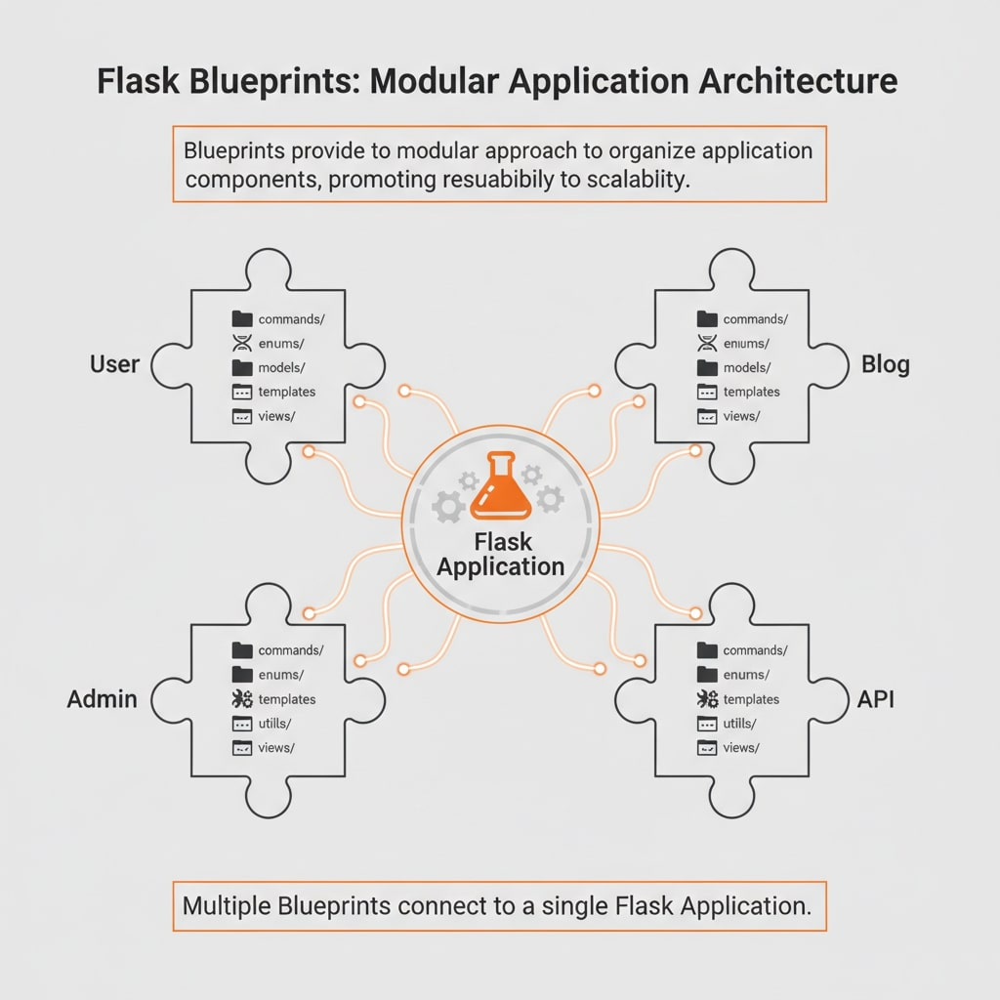

# Flask Blueprints – Modular Architecture for Flask Apps

Before going to Flask Blueprints, Let's see what Flask is? 

**Flask** is a lightweight WSGI (Web Server Gateway Interface) web application framework. It is designed to make getting started quick and easy, with the ability to scale up to complex applications.


Flask blueprints use a concept for making **application components** and supporting common patterns within or across applications.  
They follow a **modular approach** to organize routes, CLI, models, templates, etc. and can greatly simplify large applications.

A [`Blueprint`](https://flask.palletsprojects.com/en/stable/api/#flask.Blueprint) object works similarly to a [`Flask`](https://flask.palletsprojects.com/en/stable/api/#flask.Flask) application object, but it is **not actually an application**. Instead, it provides a central means for Flask extensions to register operations on applications.




---

## 📂 Folder Structure in Flask Blueprints

### `commands/`
Used to **add custom terminal commands** that can be run with the `flask` CLI tool.

**`__init__.py`**  
Contains a stubbed function `init_blueprint_cli` meant to **attach CLI commands** to the blueprint, such as database tasks, data exports, etc.

```python
from flask import Blueprint

def init_blueprint_cli(blueprint: Blueprint) -> None:
    # blueprint.cli.add_command(...)
    pass
```

If we want our blueprint to have its own custom terminal commands then define them here and register via init_blueprint_cli in routes.py

For example: flask migrate export-data
this could be our terminal command to export-data

### `enums/`

Enums are useful for defining constant values that need to be **shared across models, services, or serializers**.


---

### `models/`

Contains **Python classes that represent database tables**.  
Each class here is called a model, and it maps directly to a table in the database.

If you’re using Flask with a database (like PostgreSQL, MySQL, or SQLite), models are how you interact with your data.

---

### `templates/`

If the blueprint serves a webpage, templates live here.  

Even if we’re mainly building APIs, having a `templates/` folder allows us to create **admin panels, dashboards, or debug pages** within the blueprint.

---

### `utils/`

Contains **helper functions, validators, or small services** used across the blueprint.  

This is where you keep **modular code** that doesn’t fit into `routes` or `models`.

---

### `views/`

The `views/` folder contains the **Python functions that define what should happen when someone visits a route**.

- Views handle incoming **HTTP requests**  
- Decide what logic to run  
- Return the appropriate response

Thank you for reading till last, I hope that you might have understood the topic clearly :)